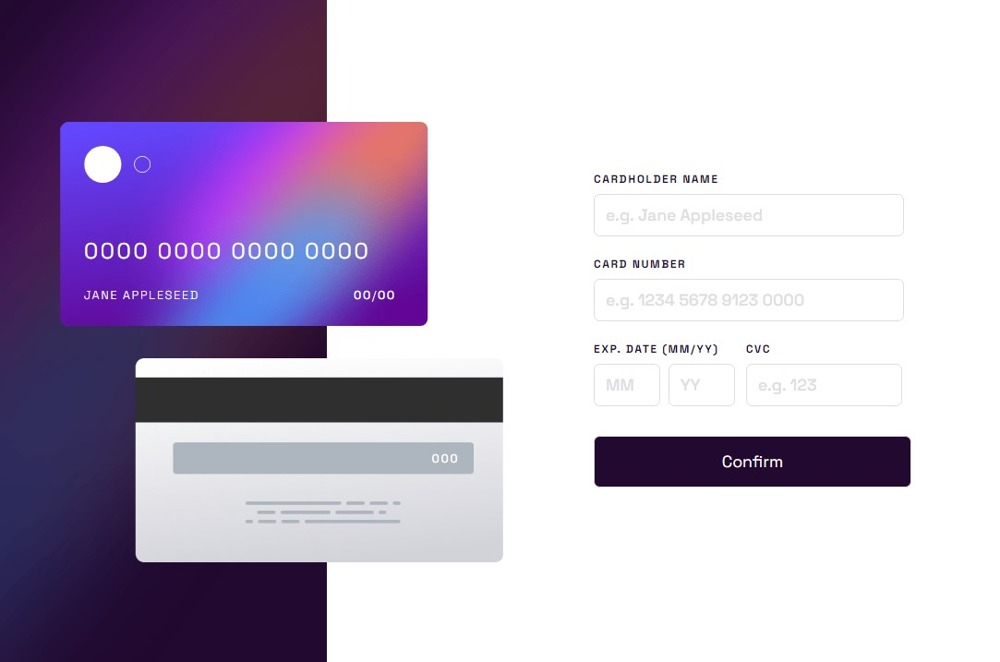
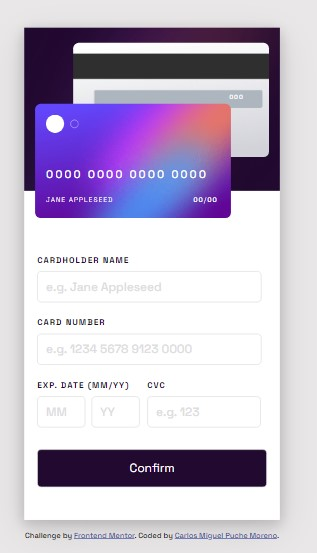

# Interactive Card Details Form: Real-time DOM Synchronization

This project is a **historical practice** focused on complex form validation and real-time UI mirroring. It represents a major step in my development, combining advanced CSS decorative techniques with sophisticated JavaScript string manipulation to create a seamless user experience.

---

## 🚀 Demo
[SEE DEMO HERE](https://cmp2007.github.io/interactive-card-details-form/)

### 🏆 Challenge Context
This project was developed as a solution to the [Interactive card details form challenge on Frontend Mentor](https://www.frontendmentor.io/solutions/interactive-card-details-form-solution-KoUJeVFM7N).

### Screenshot

---

## 📋 Evolution & Context Note
> ⚠️ **Note on my trajectory:** This repository showcases my ability to handle multi-input synchronization. I used a centralized event listener strategy and manual validation flags to manage the application state. It serves as a record of my transition from simple interaction to complex, state-dependent UI components.

## 📋 Technical Milestones of this Stage
In this specific phase of my training, I successfully achieved:

* **Real-time Data Mirroring:** Implementation of an instant feedback system where card graphics update as the user types, using `input` event listeners and `innerHTML` synchronization.
* **Advanced String Formatting:** Use of `padEnd()` to maintain card placeholders and Regular Expressions (`RegExp`) to automatically space credit card numbers into 4-digit blocks.

* **CSS Variable-Driven Styling:** Creative use of CSS Variables (`--borderColor`, `--visibleNumber`) and pseudo-elements (`::after`) to manage complex gradient borders and focus states dynamically from JavaScript.
* **Robust Validation Flow:** Development of a multi-layer validation system that checks for empty fields, incorrect formats (numbers only), and specific lengths (CVC, Month, Year) before allowing form submission.
* **Dynamic Viewport Management:** Precise use of `transform` and absolute positioning to handle the overlapping card layout, which gracefully transitions from a stacked mobile view to a sidebar desktop layout.

## 🛠️ Technologies (at the time)
* **HTML5:** Semantic forms and ARIA labels for accessibility.
* **CSS3:** Custom properties (Variables), pseudo-elements, and complex Media Queries.
* **Vanilla JavaScript:** Real-time DOM manipulation, RegEx, and conditional state logic.

---
**Coded by [Carlos Miguel Puche](https://github.com/CMP2007)**
